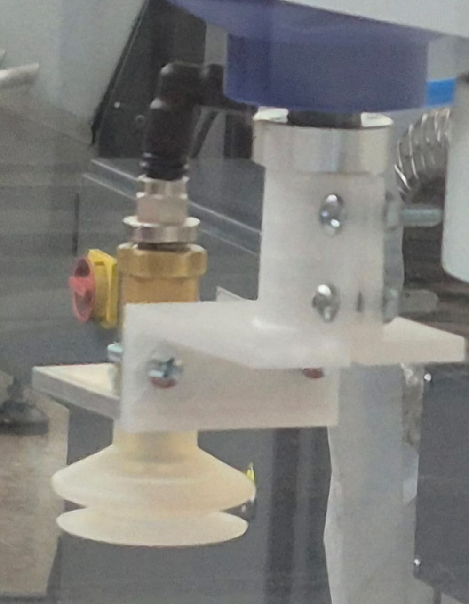
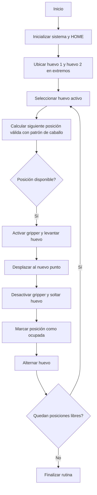
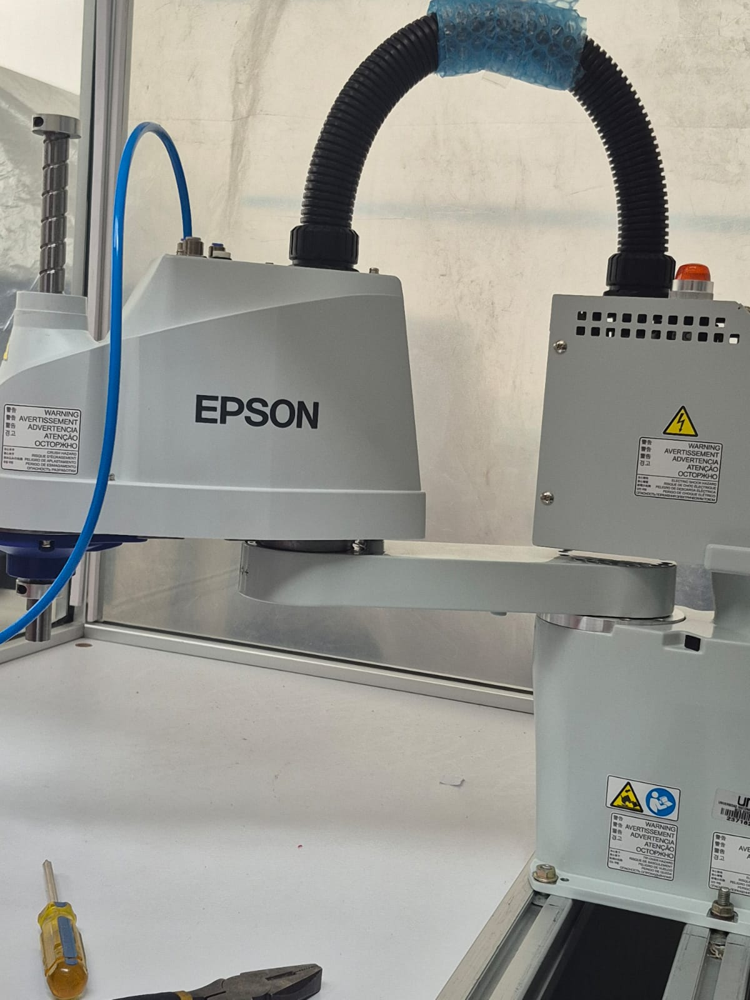
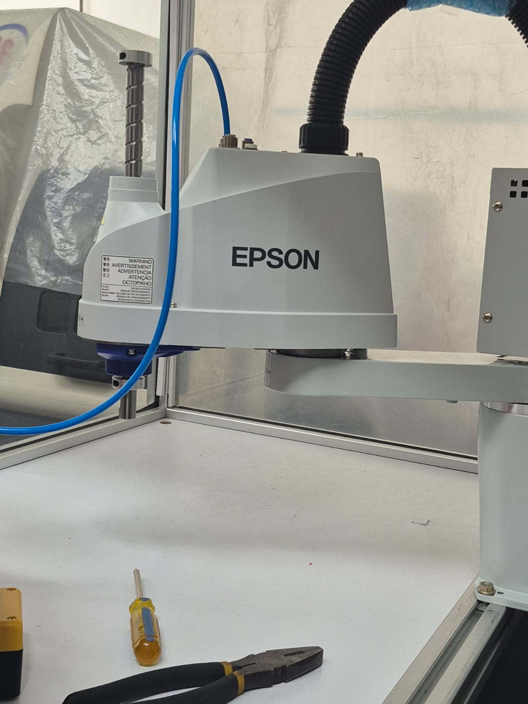
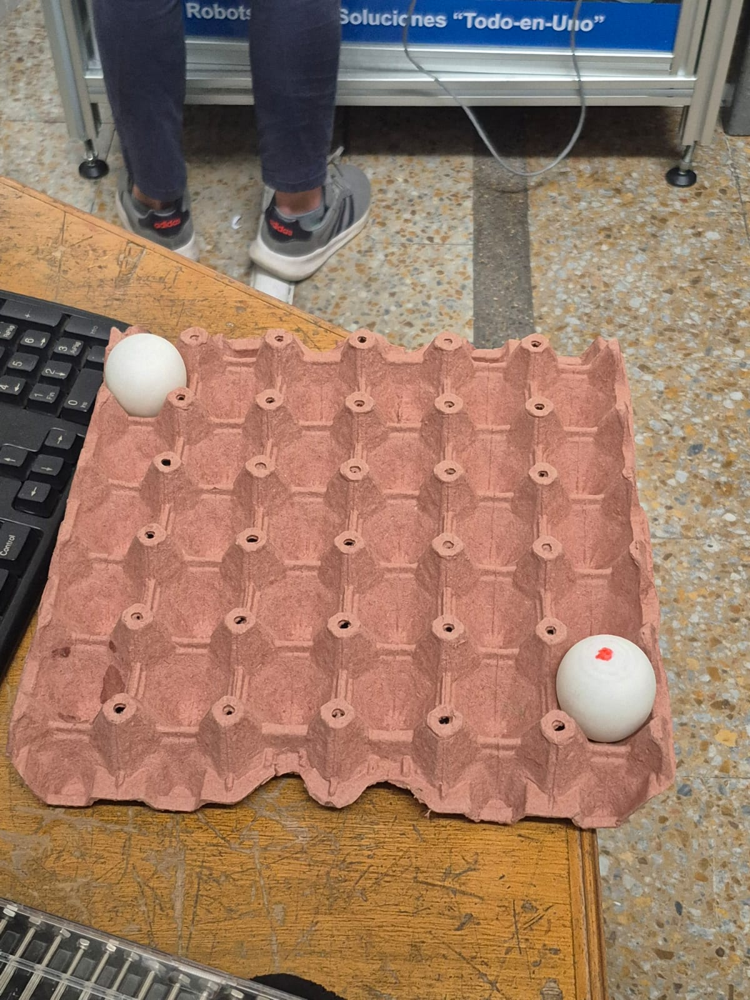
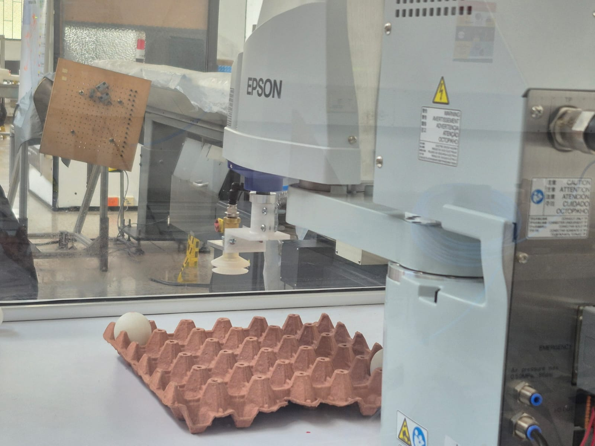

# Laboratorio No. 03
# Robótica Industrial - Análisis y Operación del Manipulador EPSON T3-401S.

* Edgar Esteban Erazo Lagos

## Introducción

Los manipuladores industriales son sistemas clave en la automatización por su capacidad de ejecutar tareas con precisión y control en entornos productivos. Sin embargo, su desempeño depende en gran medida de sus configuraciones iniciales, modos de operación y del software que los gestiona.
En este laboratorio se analiza el manipulador EPSON T3-401S mediante el uso de EPSON RC+ 7.0, con el objetivo de comprender sus configuraciones home, modos de movimiento manual, niveles de velocidad y manejo de trayectorias dentro de su espacio de trabajo. De igual forma, se diseña un gripper neumático por vacío para la manipulación segura de huevos y se implementa una rutina que sigue el patrón de movimiento del caballo en ajedrez, lo cual exige una planificación estructurada de la trayectoria.
Finalmente, se comparan las herramientas EPSON RC+ 7.0, RoboDK y RobotStudio, identificando sus diferencias y alcances en simulación, programación y control de manipuladores industriales.

## Análisis técnico comparativo
**Cuadro comparativo con especificaciones técnicas del EPSON T3-401S, Motoman MH6 y ABB IRB140**

| Ítem                                   | **EPSON T3-401S**                                | **Motoman MH6 (DX100/DX200)**                     | **ABB IRB 140 (IRC5)**                          |
|----------------------------------------|--------------------------------------------------|--------------------------------------------------|------------------------------------------------|
| **Tipo de manipulador**                | SCARA industrial                                  | Robot articulado industrial                      | Robot articulado industrial                    |
| **Grados de libertad / ejes**          | 4 ejes (SCARA)                                    | 6 ejes                                           | 6 ejes                                         |
| **Carga máxima (payload)**             | **3 kg**                                          | **6 kg**                                         | **6 kg**                                       |
| **Alcance máximo**                     | **400 mm**                                        | **1 422 mm**                                     | **810 mm**                                     |
| **Repetibilidad**                      | **±0.01 mm**                                      | **±0.08 mm**                                     | **±0.03 mm**                                   |
| **Velocidad máxima del TCP**           | Hasta **4400 mm/s**                               | Dependiente por eje (hasta 610°/s en J6)         | Dependiente por eje (hasta 450°/s en J6)       |
| **Tipo de movimiento**                 | Plano X-Y con eje Z vertical                      | Movimiento espacial 3D completo                 | Movimiento espacial 3D completo               |
| **Configuración estructural**          | SCARA rígido, alta precisión                      | Serial articulado                                | Serial articulado                              |
| **Montaje**                            | Sobre mesa o estructura fija                      | Piso, pared, techo, invertido                    | Piso, pared e invertido                        |
| **Aplicaciones típicas**               | Pick and place, ensamblaje fino                   | Manipulación, soldadura, carga/descarga          | Manipulación, ensamblaje, alta precisión      |
| **Espacio de trabajo**                 | Zona circular plana limitada                      | Volumen tridimensional amplio                    | Volumen tridimensional compacto               |
| **Software de control**                | EPSON RC+ 7.0                                    | MotoSim / RoboDK / DX100-DX200                   | RobotStudio (RAPID)                            |
| **Precisión en tareas repetitivas**    | Muy alta                                          | Alta                                             | Muy alta                                       |
| **Enfoque principal**                  | Alta velocidad y repetibilidad en plano           | Versatilidad industrial                          | Precisión y flexibilidad espacial             |

El manipulador EPSON T3-401S, al ser de tipo SCARA, está optimizado para movimientos rápidos y precisos en el plano XY, lo que lo hace especialmente eficiente en tareas de ensamblaje ligero y manipulación repetitiva. Su estructura rígida le permite alcanzar una alta repetibilidad, característica clave para aplicaciones donde la precisión dimensional es prioritaria.
En contraste, el Motoman MH6 y el ABB IRB140 son robots articulados de seis ejes, capaces de operar en entornos tridimensionales con mayor libertad geométrica. Esto les permite ejecutar tareas que requieren orientación compleja del efector final, aunque con menor especialización en desplazamientos planos rápidos.
Mientras el EPSON prioriza velocidad y exactitud en trayectorias cortas y repetitivas, los otros dos manipuladores se enfocan en versatilidad espacial y mayor rango de aplicaciones industriales. Esta diferencia justifica su selección según el tipo de proceso, siendo el T3-401S el más adecuado para operaciones controladas de pick and place como las desarrolladas en este laboratorio.

## Configuraciones HOME del EPSON T3-401S

La posición **HOME** en el manipulador EPSON T3-401S corresponde a la postura de referencia desde la cual el robot inicia su operación y establece un punto seguro de reposo. Esta configuración es utilizada tanto para inicialización del sistema como para garantizar un estado estable cuando no se ejecutan tareas activas.

En el EPSON T3-401S, la posición HOME se define mediante una combinación específica de valores para sus ejes principales (θ1, θ2, Z y θ4), logrando una postura elevada y centrada que evita interferencias con el área de trabajo, herramientas y objetos presentes en la estación. Desde un punto de vista funcional, esta posición cumple dos propósitos principales:

- **Seguridad mecánica:** mantiene el efector final alejado de la cubeta y de los huevos, reduciendo el riesgo de colisiones accidentales durante el encendido o reinicio del sistema.
- **Referencia operativa:** sirve como punto inicial para el desarrollo de trayectorias, permitiendo que los movimientos posteriores se calculen desde una base estable y consistente.

Durante el desarrollo del laboratorio, la posición HOME utilizada permitió iniciar los ciclos desde una altura suficiente sobre el plano de trabajo, facilitando la transición hacia las posiciones objetivo sin generar trayectorias forzadas ni aproximaciones peligrosas al objeto manipulado. Esta configuración resulta adecuada para la tarea propuesta, ya que equilibra estabilidad, accesibilidad y seguridad, garantizando que el robot pueda desplazarse hacia cualquier punto de la cubeta siguiendo el patrón de movimiento establecido sin comprometer la integridad del huevo ni la eficiencia del ciclo.

## Procedimiento para movimientos manuales del EPSON T3-401S

El movimiento manual del manipulador EPSON T3-401S se realiza mediante el software **EPSON RC+ 7.0** ejecutado en el computador, el cual actúa como panel de control equivalente a un teach pendant. Desde este entorno es posible seleccionar modos de operación, habilitar servomotores y ejecutar movimientos articulares o cartesianos para la enseñanza de puntos y la verificación de trayectorias.

**Activación del sistema**

1. Encender el controlador del robot y el computador con EPSON RC+ 7.0.
2. Abrir el proyecto correspondiente en EPSON RC+.
3. Colocar el sistema en modo manual (Teach) desde la interfaz del software.
4. Activar los servomotores mediante la opción **Servo ON** en la barra de control.
5. Verificar que el espacio de trabajo esté libre de obstáculos y que el efector final no esté próximo a la cubeta o a otros elementos.

**Cambio entre modos de movimiento**

El control de movimiento se realiza desde el panel de **Jog** en EPSON RC+, el cual permite seleccionar entre:

**Modo Articular (Joint)**

- Permite mover de forma independiente cada uno de los ejes del robot:
  - Eje 1: rotación de la base.
  - Eje 2: movimiento del brazo intermedio.
  - Eje 3: desplazamiento vertical (eje Z).
  - Eje 4: rotación de la herramienta alrededor del eje vertical.
- Se selecciona el modo **Joint** en el panel de jog.
- El operador acciona los botones de desplazamiento asociados a cada eje para realizar movimientos incrementales controlados.

**Modo Cartesiano (XYZ)**

- Permite mover el efector final en coordenadas rectangulares:
  - Traslación en **X** (izquierda/derecha).
  - Traslación en **Y** (adelante/atrás).
  - Traslación en **Z** (arriba/abajo).
  - Rotación alrededor del eje vertical (θ) según la configuración del TCP.
- Se selecciona el modo **XYZ** en el panel de jog.
- El movimiento se realiza manteniendo la orientación definida del efector final, lo que resulta útil para aproximaciones controladas sobre la cubeta de huevos.

**Movimientos de traslación y rotación**

En modo cartesiano, el operador puede ajustar la posición del TCP de forma directa:

- **X+/X−:** desplazamientos laterales.
- **Y+/Y−:** acercamiento y alejamiento respecto a la cubeta.
- **Z+/Z−:** subida y bajada del efector para aproximación a la superficie del huevo.
- **Rotación θ:** ajuste de la orientación de la herramienta cuando sea necesario.

Estos movimientos se ejecutan desde el teclado o los controles gráficos del panel de jog, con pasos incrementales ajustables según la configuración seleccionada en EPSON RC+.

**Consideraciones operativas**

- Se recomienda iniciar siempre con velocidades bajas al acercarse a la cubeta o al huevo.
- El modo articular es más adecuado para movimientos globales y reposicionamientos amplios.
- El modo cartesiano es preferible para aproximaciones finales y correcciones finas sobre el plano de trabajo.
- Todos los movimientos deben realizarse manteniendo visibilidad directa del robot y controlando los incrementos de jog para evitar colisiones.

Este procedimiento permite realizar de forma segura la enseñanza de puntos y la verificación de trayectorias necesarias para implementar la rutina de movimiento basada en el patrón de caballo.

## Niveles de velocidad en movimientos manuales del EPSON T3-401S

El manipulador EPSON T3-401S permite regular la velocidad de los movimientos manuales directamente desde la interfaz de **EPSON RC+ 7.0** en el computador, el cual funciona como panel de control tipo teach pendant. Esta configuración resulta fundamental para garantizar precisión, seguridad y control durante la enseñanza de puntos y la manipulación de huevos.

La velocidad se ajusta desde el panel de jog, donde el operador puede seleccionar diferentes niveles según el tipo de movimiento que se requiera, el entorno inmediato y la proximidad al objeto manipulado.

**Niveles disponibles de velocidad**

El sistema dispone de varios niveles de velocidad configurables para el movimiento manual, los cuales se emplean según la etapa del proceso:

| Nivel | Uso típico | Característica principal |
|------|------------|---------------------------|
| Velocity Low | Aproximaciones cercanas al huevo o a la cubeta | Movimiento lento y controlado, ideal para evitar impactos y vibraciones |
| Velocity Medium | Posicionamientos generales dentro del área de trabajo | Compromiso entre rapidez y control |
| Velocity High | Desplazamientos amplios en zonas despejadas | Movimiento rápido para recorridos largos |
| Incremental Step | Ajustes finos de alta precisión | Desplazamientos en pasos pequeños definidos por el operador |

**Cambio entre niveles de velocidad**

El cambio de velocidad se realiza desde la sección de control del jog en EPSON RC+, donde el operador puede seleccionar el nivel deseado mediante un control deslizante o selector numérico asociado a la velocidad de los movimientos manuales. La velocidad seleccionada afecta tanto al modo articular como al cartesiano.

Cada cambio se refleja de forma inmediata en la respuesta del robot, permitiendo adaptar el comportamiento del movimiento según la fase de trabajo.

**Identificación del nivel activo**

El nivel de velocidad activo se visualiza directamente en la interfaz gráfica de EPSON RC+, usualmente junto al panel de jog o en la barra de estado, indicando el valor porcentual o la categoría seleccionada (Low, Medium, High).

Esto permite al operador tener control visual constante sobre el estado dinámico del robot, reduciendo el riesgo de movimientos bruscos o no deseados.

**Consideraciones de uso**

- Para acercamientos finales al huevo se recomienda utilizar niveles bajos o pasos incrementales.
- Las velocidades medias son adecuadas para transiciones entre posiciones dentro de la cubeta.
- Las velocidades altas sólo deben emplearse cuando el recorrido esté libre de obstáculos y el efector se encuentre lejos de la zona sensible.
- El uso inadecuado de velocidades elevadas puede comprometer la estabilidad del huevo y la precisión de posicionamiento.

La correcta selección del nivel de velocidad contribuye significativamente a la seguridad del proceso, al control fino del manipulado y a la ejecución estable de la rutina bajo el patrón de movimiento del caballo.

## EPSON RC+ 7.0: funcionalidades y comunicación con el manipulador EPSON T3-401S

EPSON RC+ 7.0 es el entorno de software utilizado para la programación, control y supervisión del manipulador EPSON T3-401S. Desde este sistema, ejecutado en el computador, se realizan tanto los movimientos manuales como la creación y ejecución de rutinas automáticas, funcionando como interfaz principal entre el operador y el robot. El software permite gestionar la configuración del robot, definir parámetros de movimiento, enseñar puntos, programar secuencias y monitorear el estado del sistema en tiempo real, consolidándose como la herramienta central para la operación del manipulador durante el laboratorio.

**Funcionalidades principales**

EPSON RC+ 7.0 ofrece un conjunto de herramientas orientadas al control completo del sistema robótico, entre las cuales se destacan:

- Configuración del robot y parametrización de ejes y límites de trabajo.
- Control manual mediante panel de jog con modos articular y cartesiano.
- Enseñanza de puntos (Teach Points) y registro de posiciones.
- Programación de rutinas automatizadas mediante el lenguaje propio de EPSON.
- Simulación de trayectorias antes de su ejecución física.
- Control y monitoreo de entradas y salidas digitales para dispositivos externos, como el gripper neumático.
- Supervisión del estado de servomotores, errores y alarmas del sistema.
- Ejecución de programas en modo paso a paso o continuo.

Estas funcionalidades permiten estructurar de manera ordenada la lógica de la rutina requerida para el movimiento de los huevos siguiendo el patrón de caballo.

**Comunicación con el manipulador**

La comunicación entre EPSON RC+ 7.0 y el manipulador EPSON T3-401S se realiza a través del controlador del robot, estableciendo un enlace directo que permite el envío y recepción de comandos en tiempo real. El flujo básico de comunicación se desarrolla de la siguiente forma:

1. El software EPSON RC+ establece conexión con el controlador del robot.
2. El operador carga el programa o rutina desde el entorno del software.
3. EPSON RC+ envía comandos de movimiento, velocidad y posicionamiento al manipulador.
4. El controlador interpreta estos comandos y los convierte en señales de control para los motores.
5. El robot ejecuta el movimiento siguiendo la trayectoria definida.
6. El sistema retroalimenta información de estado, posición y posibles alarmas al software.

Este proceso asegura que las trayectorias programadas sean ejecutadas con precisión y bajo supervisión constante.

**Ejecución de movimientos mediante EPSON RC+**

Durante la ejecución de una rutina, EPSON RC+ realiza los siguientes procesos:

- Interpreta la secuencia de instrucciones programadas.
- Calcula las posiciones intermedias y finales requeridas.
- Controla la aceleración y desaceleración de cada movimiento.
- Coordina la activación de salidas digitales para el accionamiento del gripper.
- Verifica que los movimientos se mantengan dentro de los límites seguros de operación.

De esta manera, EPSON RC+ no solo actúa como interfaz gráfica, sino como sistema integral de control que gestiona la cinemática, la seguridad y la lógica de operación del manipulador. La correcta utilización de EPSON RC+ 7.0 resulta esencial para garantizar que la rutina de desplazamiento de huevos se ejecute de manera segura, precisa y coherente con el patrón de movimiento definido.

## Análisis comparativo entre EPSON RC+ 7.0, RoboDK y RobotStudio

Las herramientas EPSON RC+ 7.0, RoboDK y RobotStudio cumplen funciones similares dentro del entorno de la robótica industrial, pero están orientadas a enfoques y niveles de integración distintos. Su comparación permite entender cómo cada una condiciona la forma de programar, simular y operar un manipulador.

**Comparación general**

| Criterio | EPSON RC+ 7.0 | RoboDK | RobotStudio |
|----------|---------------|--------|-------------|
| Compatibilidad | Exclusivo para robots EPSON | Multimarca (ABB, Yaskawa, KUKA, Fanuc, UR, etc.) | Exclusivo ABB |
| Enfoque principal | Control y programación directa del robot | Simulación y programación offline | Simulación con controlador virtual real |
| Nivel de integración | Total con hardware EPSON | Parcial, depende del post-procesador | Total con ecosistema ABB |
| Lenguaje de programación | Lenguaje propio EPSON | Interfaz gráfica + API Python | RAPID |
| Fidelidad entre simulación y robot | Alta dentro del entorno EPSON | Variable según robot y post | Muy alta |
| Uso en laboratorio | Operación física real del robot | Diseño y simulación de trayectorias | Validación avanzada de celdas ABB |

**EPSON RC+ 7.0**

EPSON RC+ 7.0 es una herramienta orientada al control directo y específico del manipulador EPSON. Su principal fortaleza radica en la integración nativa con el hardware, lo que permite supervisar, programar y ejecutar movimientos con altos niveles de precisión y seguridad. Es especialmente útil cuando el objetivo es operar físicamente el robot y validar su comportamiento real en el entorno de trabajo. Sin embargo, su uso se encuentra limitado al ecosistema EPSON, lo que restringe su aplicabilidad en contextos multimarca o en simulaciones previas complejas fuera del hardware real.

**RoboDK**

RoboDK se caracteriza por su flexibilidad y enfoque en programación offline. Permite diseñar trayectorias complejas, simular movimientos y generar código para distintos fabricantes desde una sola plataforma. Su principal ventaja es la rapidez con la que se pueden desarrollar y visualizar trayectorias, lo que resulta ideal para entornos académicos y procesos de prototipado. No obstante, la fidelidad entre simulación y ejecución real depende del post-procesador y del robot, por lo que no siempre replica con exactitud el comportamiento físico del manipulador.

**RobotStudio**

RobotStudio es una herramienta altamente especializada para robots ABB. Su mayor fortaleza reside en el uso de un controlador virtual que replica con gran precisión el funcionamiento del robot real, permitiendo pruebas detalladas de programas RAPID antes de su ejecución física. Su limitación principal es su exclusividad con robots ABB, lo que reduce su utilidad en entornos con múltiples marcas o cuando se trabaja con robots distintos al ecosistema ABB.

**Interpretación técnica**

EPSON RC+ se posiciona como la herramienta más adecuada para la operación directa y control real del manipulador EPSON T3-401S. RoboDK destaca por su flexibilidad y facilidad de uso para el diseño inicial de trayectorias, mientras que RobotStudio se orienta a escenarios de validación exhaustiva en entornos ABB. En el contexto de este laboratorio, EPSON RC+ 7.0 resulta la herramienta central, ya que permite integrar la simulación, la programación y la ejecución física de la rutina de movimiento siguiendo el patrón de caballo, mientras que RoboDK y RobotStudio funcionan como referentes comparativos en cuanto a metodologías y capacidades de simululación.

## Diseño del gripper neumático por vacío

Para la manipulación de los huevos se diseñó e implementó un gripper neumático por vacío, con el objetivo de garantizar una sujeción estable sin comprometer la integridad estructural del objeto. El sistema fue seleccionado teniendo en cuenta el bajo peso del huevo, su fragilidad y la necesidad de un contacto uniforme que evitara concentraciones de esfuerzo. El gripper usado, utiliza una ventosa de succión conectada a un sistema neumático controlado mediante las entradas y salidas digitales del manipulador EPSON T3-401S. La activación y desactivación del vacío se realiza desde EPSON RC+ 7.0, permitiendo sincronizar la sujeción con las posiciones programadas durante la trayectoria.

A continuación se presenta el gripper físico implementado en el laboratorio, el cual fue utilizado para las pruebas de manipulación y la ejecución de la rutina con patrón de movimiento tipo caballo.

 **Gripper neumático implementado**

 

 
## Diagrama de flujo de la rutina de movimiento con patrón de caballo

El siguiente diagrama representa la lógica general utilizada para la ejecución de la rutina de movimiento de los huevos dentro de la cubeta, siguiendo estrictamente el patrón de desplazamiento del caballo en ajedrez y alternando entre los dos huevos en cada ciclo.

La secuencia se basa en la selección de una posición válida según el patrón, verificación de disponibilidad, activación del gripper y traslado controlado hasta el siguiente punto permitido.

## Plano de planta de la ubicación de la cubeta y posiciones iniciales

El plano de planta define la disposición espacial del manipulador EPSON T3-401S respecto a la cubeta de huevos de 30 posiciones (6x5) y la ubicación inicial de los dos huevos empleados en la rutina. La cubeta fue ubicada dentro del área operativa del robot, asegurando que todas las posiciones fueran alcanzables sin generar colisiones ni trayectorias forzadas. Los huevos se colocaron inicialmente en dos extremos opuestos de la matriz, permitiendo un recorrido alternado y ordenado bajo el patrón de movimiento del caballo.

**Plano de planta**

[Aquí se adjunta la imagen del plano de planta con la posición de la cubeta y huevos iniciales]

## Análisis de inconvenientes en la ejecución del sistema

Durante las pruebas realizadas en el manipulador EPSON T3-401S se evidenció un comportamiento inconsistente del sistema, en el cual la rutina funcionaba correctamente en ciertos ciclos, pero posteriormente se desconfiguraba y dejaba de ejecutarse de forma adecuada sobre el robot físico. Aunque la lógica del código cumplía con la secuencia definida y el patrón de movimiento del caballo estaba estructurado correctamente, haciendo posible una simulación exitosa, se observaron fallos progresivos en la ejecución, tales como desviaciones inesperadas, pérdida de precisión y respuestas erráticas en el seguimiento de la trayectoria.

Una posible causa de este comportamiento puede estar asociada a la complejidad del código implementado, el cual incluye múltiples validaciones, cálculos de posiciones y alternancia entre huevos, lo que pudo generar sobrecarga en la interpretación y ejecución del sistema, especialmente en combinación con las limitaciones propias del hardware y del entorno de control.

Adicionalmente, factores como:
- Errores acumulativos de posicionamiento,
- Saturación de tareas internas del controlador,
- Tiempos de respuesta variables,
- Sincronización con las señales del gripper,

pudieron contribuir a la degradación del comportamiento durante la operación prolongada.

A pesar de ello, se logró verificar la funcionalidad general del algoritmo y su correcta lógica estructural, evidenciando que el sistema cumple conceptualmente con la restricción del patrón de caballo, aunque requiere ajustes adicionales para mejorar su estabilidad y robustez en ejecuciones prolongadas. Este comportamiento resalta la importancia de considerar no sólo la validez lógica del código, sino también su impacto sobre el desempeño real del sistema físico, especialmente en entornos de control industrial.

## Código en SPEL+

El código realizado en EPSON RC+ 7.0 para el desarrollo de la actividad se puede encontrar dentro del archivo llamado *"Codigo"*.

## Video explicativo

Para un mayor detalle de la actividad realizada, se puede observar un video de la simulación en el programa [aquí](https://youtu.be/0w4i8Z4rHYc)

