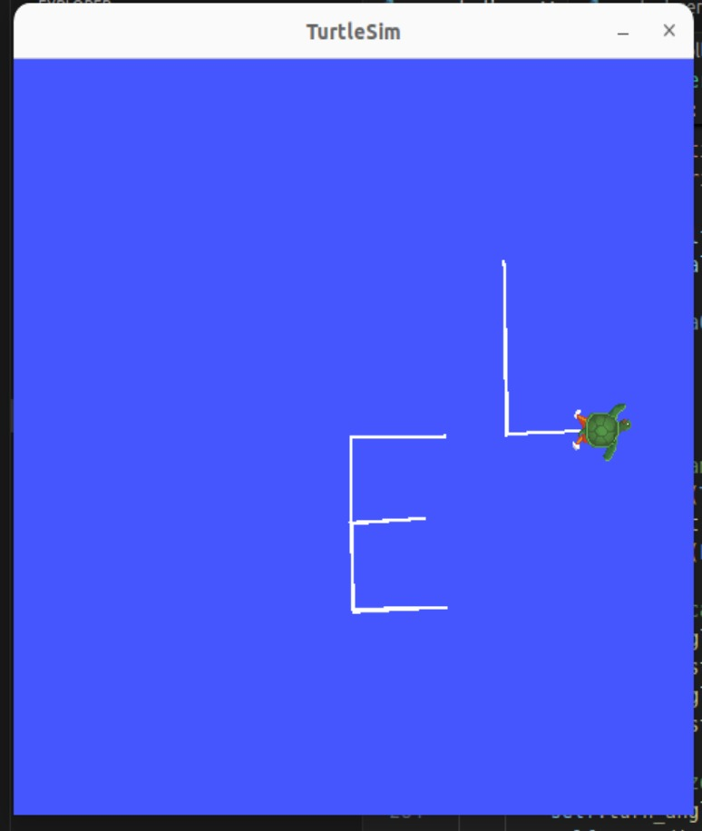
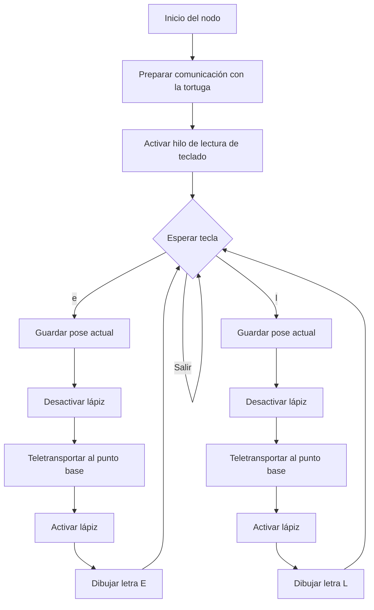

# Laboratorio No. 04

##  Robótica de Desarrollo, Intro a ROS 2 Humble- Turtlesim

* Edgar Esteban Erazo Lagos

## Introducción

En este laboratorio se trabaja sobre el entorno de ROS 2 utilizando el simulador Turtlesim, con el fin de comprender mejor la relación entre un nodo programado por el usuario y el comportamiento gráfico que se observa en pantalla.

La propuesta se centra en el desarrollo de un script que controle a la tortuga sin recurrir a nodos de teleoperación preexistentes. En este caso, la tortuga no se mueve de forma libre ni por comandos generales, sino que ejecuta trayectorias específicas para dibujar letras cuando se presionan teclas determinadas. Las letras implementadas son E y L.

Todas las acciones de movimiento son gestionadas desde un único archivo, el cual contiene la lógica completa del sistema, desde la lectura del teclado hasta la generación de los trazos finales.

## 2. Enfoque del laboratorio

El objetivo práctico se centra en controlar la tortuga desde un único script, permitiendo realizar un dibujo automático de letras asociadas al nombre del integrante, manteniendo un manejo coherente y claro de las letras. 

## 3. Documentación del desarrollo

El control de la tortuga se implementa mediante un nodo llamado `turtle_controller`, definido dentro del archivo `move_turtle.py`. Este nodo es propio, ya que fue creado específicamente para este laboratorio y no corresponde a ninguna herramienta estándar de ROS. Esto significa que el movimiento observado en pantalla es resultado directo de la programación realizada, y no de mecanismos automáticos ya incluidos en el sistema.

El nodo se encarga de:

* Publicar comandos de velocidad hacia `/turtle1/cmd_vel`.
* Leer continuamente la posición y orientación de la tortuga a través de `/turtle1/pose`.
* Utilizar servicios de Turtlesim para reposicionar la tortuga y controlar si esta deja rastro o no al moverse.
* Interpretar entradas del teclado para activar el dibujo de las letras definidas.

Cuando el usuario presiona la tecla correspondiente, el nodo ejecuta la función asociada a esa letra.

## 4. Funcionamiento general

Cada letra se construye a partir de la posición en la que se encuentra la tortuga en el momento de presionar la tecla. Esa posición se toma como punto base de referencia. A partir de allí se generan movimientos rectos y giros controlados, calculando el desplazamiento necesario para alcanzar las distancias deseadas.

Para evitar trazos no deseados entre letras, el nodo desactiva temporalmente el lápiz, se transporta a la tortuga a la nueva posición base y luego reanuda el dibujo. De este modo se logra que las letras aparezcan separadas y visualmente limpias.

> Pruebas previas de letras realizadas, con alineamiento no adecuado.

**Letra E**

La letra E se dibuja tomando como referencia la esquina inferior izquierda. Primero se traza una línea vertical ascendente que constituye el cuerpo principal de la letra. Posteriormente se dibujan tres líneas horizontales: una en la parte superior, una en la zona media y una en la base. Todas estas líneas parten desde el eje vertical, manteniendo proporciones visualmente coherentes.

Al finalizar la letra, la tortuga se reubica hacia la derecha, sin dejar rastro visible, quedando preparada para el siguiente dibujo.

**Letra L**

La letra L se construye partiendo de la misma altura base que la letra E, garantizando alineación entre ambas. Se dibuja inicialmente una línea vertical hacia arriba y luego una línea horizontal inferior que completa la forma característica de la letra.

Este proceso también se realiza sin generar trazos no deseados entre letras, conservando una presentación clara del resultado.

> Letras realizadas, con alineamiento, y claridad adecuadas.

**Flujo de ejecución**

El proceso de uso por parte del usuario es el siguiente:

1. Compilar el workspace con `colcon build`.
2. Cargar el entorno con `source install/setup.bash`.
3. Ejecutar el simulador Turtlesim.
4. Lanzar el nodo `turtle_controller`.
5. Presionar la tecla `e` para dibujar la letra E.
6. Presionar la tecla `l` para dibujar la letra L.

En ningún momento se utiliza el nodo `turtle_teleop_key`, cumpliendo así con la restricción impuesta en el enunciado del laboratorio.

## 5. Diagrama de flujo

El comportamiento general del nodo puede resumirse en el siguiente diagrama de flujo, donde se observa cómo las entradas del teclado determinan el trazado de las letras:

Este diagrama muestra que el nodo permanece en un ciclo continuo de espera, respondiendo de forma directa a las teclas definidas y ejecutando la secuencia de dibujo correspondiente.

## 6. Proceso de prueba y ajuste

Las pruebas se realizaron de forma progresiva:

* Prueba individual de cada letra.
* Ajuste de longitudes y ángulos hasta obtener formas reconocibles.
* Permitir una alineación adecuada y una separación clara entre las letras.

El resultado final permite visualizar claramente cada letra en la interfaz de Turtlesim.

## 7. Resultados obtenidos

Se logró:

* Control preciso de la tortuga desde teclado.
* Generación de letras claras a partir de combinaciones de movimientos.
* Envío correcto de ordenes, lectura adecuada de posición y movimiento.

Esto demuestra la correcta comprensión del modelo de comunicación de ROS 2 en un entorno gráfico simple.

## 8. Conclusiones

El laboratorio permitió evidenciar de forma práctica la interacción entre diferentes funcionalidades y variables en ROS 2.

Se logró una comunicación correcta entre el nodo programado y los componentes de ROS 2, permitiendo controlar el movimiento de la tortuga y gestionar su posición sin comportamientos inesperados.

El sistema desarrollado constituye una base funcional sobre la cual se pueden construir comportamientos más complejos, como escritura automática de palabras completas o integración con otras interfaces de entrada.

## 9. Código para TurtlleSim en ROS

El código realizado en Python para el desarrollo de la actividad se puede encontrar como move_turtle.py  dentro de la carpeta llamada *"Codigo"*.

## 10. Video explicativo

Para un mayor detalle de la actividad realizada, se puede observar un video de la simulación en el programa, junto con su explicación [aquí](https://youtu.be/yO0ROJNMGEU)

Contenido listo para ser adaptado directamente a diapositivas, manteniendo coherencia con el trabajo real y sin replicar de forma literal el formato del repositorio original.
