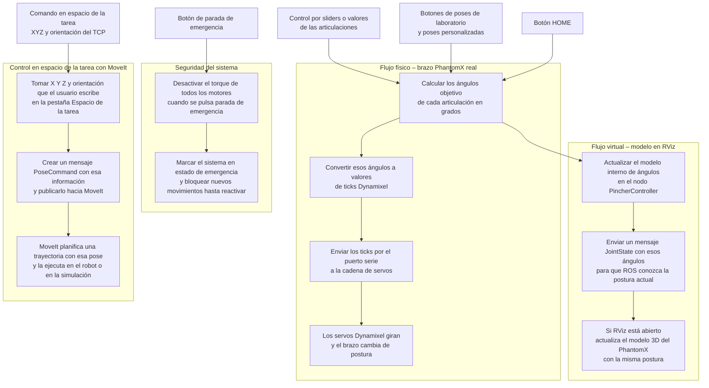

# Laboratorio No. 5

##  Pincher Phantom X100- ROS Humble- RVIZ

* Edgar Esteban Erazo Lagos
  
## Introducción

Este informe resume el trabajo realizado en el Laboratorio 5 de Robótica, donde se implementó y probó la cinemática directa del robot PhantomX Pincher X100 usando ROS 2 y una interfaz gráfica propia en Python. La idea no es solo mostrar que el robot se mueve, sino dejar claro cómo se hizo, y las implicaciones que esto tiene. 

A lo largo del documento se describen los principales componentes del sistema, como el nodo `pincher_controller`, GUI con pestañas para control articular y visualización, y la integración con RViz, junto con las pruebas que se hicieron en simulación y con el robot real. La intención es que la persona que abra este repositorio pueda comprender cómo reproducir el laboratorio y qué se hizo para que el PhantomX responda de forma estable y coherente con el modelo teórico.


## 1. Descripción detallada de la solución planteada

La solución propuesta para el laboratorio 5 consiste en un nodo de ROS 2, el cuál es llamado `pincher_controller` y una interfaz de usuario en Python llamada `PincherGUI`, que permiten mover el PhantomX Pincher X100 y ver su estado tanto en el robot real como en RViz.  
La idea central es que el HMI cumpla con lo pedido en la guía:

- Mostrar nombres y datos del integrante del grupo.
- Permitir mover el robot en espacio articular con **sliders**.
- Permitir mover el robot en espacio articular con **valores numéricos**.
- Enviar **poses predefinidas** del laboratorio.
- Visualizar el robot en RViz junto con la pose del TCP.
- Tener una pestaña adicional para **control en espacio de la tarea** (XYZ + RPY).

Todo esto se integra en un solo programa que abre el puerto serie, configura los servos Dynamixel y publica la información necesaria para que ROS 2 y RViz mantengan sincronizado el modelo digital con el brazo físico.


### 1.1. Hardware y software usados

Para implementar la solución se usa:

- Robot **PhantomX Pincher X100** de 5 GDL.
- Servomotores Dynamixel AX, configurados con:
  - `PROTOCOL_VERSION = 1.0`
  - `baudrate = 57600`
  - `dxl_ids = [1, 2, 3, 4, 5]`
- Adaptador USB–Serial para la cadena Dynamixel.
- Computador con:
  - Ubuntu 22.04 en máquina virtual llamada VMware.
  - ROS 2 Humble.
  - Python 3.10.
- Paquetes ROS 2 relevantes:
  - `pincher_control` que son el nodo de control y GUI.
  - `phantomx_pincher_description` esto es URDF y launch de RViz.
  - `phantomx_pincher_interfaces` esto es mensaje `PoseCommand` para el espacio de la tarea.

Este conjunto de hardware y software permite cerrar el ciclo completo: desde el comando del usuario en la GUI, pasando por ROS 2, hasta el movimiento físico de los servos y la visualización del robot en RViz.


### 1.2. Estructura del paquete `pincher_control`

El archivo principal es `control_servo.py`. En él se definen dos componentes clave:

- `class PincherController(Node)`  
  Nodo de ROS 2 que:
  - Abre el puerto serie y configura baudrate, torque, velocidad y posición inicial de los motores.
  - Mantiene un vector `current_joint_positions` con los ángulos actuales de las articulaciones.
  - Publica `JointState` en `/joint_states` para que `robot_state_publisher` y RViz actualicen el modelo.
  - Calcula la cinemática directa del TCP con un modelo DH, ejemplo link lengths `L1..L4` y publica:
    - `PoseStamped` en `/tcp_pose`.
    - Un `Marker` de texto en `/tcp_pose_marker` con XYZ y RPY.

- `class PincherGUI`  
  Interfaz en Tkinter que funciona como HMI del laboratorio. Organiza la interacción en pestañas:
  - **Control por Sliders** es el espacio articular con sliders.
  - **Control por Valores** es el espacio articular con valores numéricos.
  - **Visualización RViz** lanza y detiene RViz.
  - **Control por Pose** se muestran poses del laboratorio y poses personalizadas.
  - **Espacio de la Tarea** describe XYZ + RPY hacia `pose_command`.
  - **Acerca de** son datos del estudiante y del curso.

El nodo y la GUI se ejecutan en paralelo: ROS 2 corre en un hilo con `rclpy.spin`, mientras que la interfaz gráfica corre en el hilo principal con `tkinter.mainloop`.


### 1.3. Interfaz gráfica – control articular

Esta parte del HMI cubre las dos primeras pestañas que pide la guía: control por sliders y control por ingreso numérico.

#### 1.3.1. Pestaña 1 – Control por sliders

En esta pestaña se mueven las articulaciones en tiempo real usando sliders en grados:

- Cada motor tiene:
  - Etiqueta `Motor i`.
  - Slider de ángulo en el rango `MIN_ANGLE_DEG` a `MAX_ANGLE_DEG`.
  - Etiqueta con la posición actual en grados.
- Debajo hay un slider global de **velocidad**:
  - Si la velocidad es 0, no se envían comandos a los servos.
  - La velocidad se aplica a todos los motores a través de `update_speed`.

Cuando el usuario mueve un slider, se ejecuta `on_motor_slider_change`, que:

1. Toma el ángulo en grados.
2. Lo convierte a ticks con `degrees_to_dxl`.
3. Llama a `move_motor`, que:
   - Actualiza `current_joint_positions` esto para que RViz se sincronice.
   - Envía el valor al servo si el hardware está disponible.

#### 1.3.2. Pestaña 2 – Control por valores manuales

En esta pestaña se ingresa directamente el ángulo deseado para cada articulación:

- Para cada motor:
  - Campo de texto con el ángulo en grados.
  - Botón **Mover Motor**.
  - Etiqueta de estado tales como “Listo”, “Enviado”, errores de rango, etc.
- Hay un botón **MOVER TODOS LOS MOTORES** que:
  - Lee todos los campos.
  - Verifica que los ángulos estén dentro de los límites.
  - Convierte a ticks y envía el comando a cada servo.

La pestaña 2 usa el mismo slider de velocidad que la pestaña 1.  
Cuando se mueven los motores desde aquí, se actualizan también los sliders de la pestaña de control por sliders para mantener la coherencia visual.


### 1.4. Visualización en RViz

Esta parte corresponde a la pestaña de visualización pedida en la guía.

#### 1.4.1. Pestaña 3 – Visualización en RViz

La pestaña muestra botones para lanzar y detener RViz:

- Botón **LANZAR RViz**:
  - Ejecuta:
    ```bash
    ros2 launch phantomx_pincher_description view.launch.py
    ```
  - Abre el modelo URDF del PhantomX Pincher X100 y el `robot_state_publisher`.
- Botón **DETENER RViz**:
  - Termina el proceso lanzado en segundo plano.
  - Actualiza el estado de la interfaz.

Mientras tanto, el nodo `PincherController` mantiene actualizada la visualización publicando:

- `JointState` en `/joint_states` con las posiciones articulares.
- `PoseStamped` en `/tcp_pose` con la posición y orientación del TCP.
- Un `Marker` de texto en `/tcp_pose_marker` con XYZ y RPY en grados.

De esta forma, cualquier movimiento ordenado desde la GUI se refleja tanto en el robot físico como en el modelo de RViz.


### 1.5. Poses del laboratorio y control global

Esta sección agrupa la pestaña de **Control por Pose** y los botones globales de la parte inferior del HMI.

#### 1.5.1. Pestaña 4 – Poses del laboratorio

Se implementan cinco poses tomadas de la guía del laboratorio 5 y dos poses personalizadas:

- Pose Lab 1: `[0, 0, 0, 0, 0]`.
- Pose Lab 2: `[25, 25, 20, -20, 0]`.
- Pose Lab 3: `[-35, 35, -30, 30, 0]`.
- Pose Lab 4: `[85, -20, 55, 25, 0]`.
- Pose Lab 5: `[80, -35, 55, -45, 0]`.
- Pose 6 (personalizada): `[10, 20, 30, 40, 50]`.
- Pose 7 (personalizada): `[-10, -20, -30, -40, -50]`.

Cada botón llama a `start_pose_sequence`, que:

1. Construye una secuencia de `(motor_id, ángulo)` en el orden deseado.
2. Convierte cada ángulo a ticks.
3. Mueve los motores uno por uno con un retardo entre articulaciones.
4. Actualiza el estado del botón y de la etiqueta global para indicar que la secuencia está en ejecución o completada.

#### 1.5.2. Botones HOME y parada de emergencia

En la parte inferior de la ventana principal hay dos botones globales:

- **HOME**  
  - Llama a `home_all_motors`.
  - Envía a todos los motores a `DEFAULT_GOAL` esto es equivalente a 0° en la GUI.
  - Sincroniza sliders y campos de texto para mostrar 0° en cada articulación.

- **PARADA DE EMERGENCIA**  
  - Llama a `emergency_stop`.
  - Desactiva el torque de todos los motores.
  - Cambia los mensajes de estado a “EMERGENCIA” y bloquea el movimiento.
  - Para volver a operar, se reactiva el sistema y se lleva el robot a HOME.

Con esto, la solución propuesta cubre los requisitos de la guía los cuales control articular por sliders y por valores, selección de poses, visualización en RViz y manejo seguro del robot físico.


## 2. Diagrama de flujo de acciones del robot

En esta sección se resume el recorrido que sigue el sistema desde que se ejecuta el nodo control_servo hasta que el robot físico o la simulación responden a un comando de la interfaz. El diagrama se describe con Mermaid para poder verlo en GitHub de forma directa.



## 3. Plano de planta y distribución de elementos

En esta sección se documenta cómo está organizado el montaje del robot, por tanto se adjuntaran imagenes físicas como del RViz donde se puedan apreciar sus componentes: 


- Posición del PhantomX Pincher X100 respecto al borde de la mesa.
- Ruta de los cables de alimentación y comunicación para que no interfieran con el movimiento.
- Zona segura alrededor del brazo para evitar golpes con objetos cercanos.


## 4. Resumen de funciones principales del código

Aquí se resumen las funciones principales usadas en este laboratorio y su propósito:

- `initialize_motors(...)`  
  Configura torque, velocidad y posición inicial de cada motor y deja al robot en HOME.

- `dxl_to_radians(...)` / `radians_to_dxl(...)`  
  Conversión entre ticks Dynamixel y radianes para manejar cinemática.

- `dxl_to_degrees(...)` / `degrees_to_dxl(...)`  
  Conversión entre ticks y grados para que la GUI sea intuitiva.

- `move_motor(...)`  
  Actualiza la posición interna de la articulación y envía el comando al servo, esto si el hardware se encuentra conectado.

- `update_speed(...)` y `update_speed_single_motor(...)`  
  Ajustan la velocidad de todos los motores o de un motor específico.

- `home_all_motors()`  
  Lleva el brazo a HOME y deja el sistema en una postura de referencia.

- `emergency_stop()` / `reactivate_torque()`  
  Manejan la parada de emergencia y la posterior reactivación del sistema.

- `compute_tcp_fk()` y `update_tcp_pose()`  
  Calculan la cinemática directa del TCP con el modelo DH y publican su pose en ROS 2.

- `publish_joint_states()`  
  Publica `JointState` en `/joint_states` para sincronizar con RViz.

- `update_joints_timer()`  
  Actualiza en la GUI la barra inferior con XYZ, RPY y los ángulos `q1` a `q5`.

- `start_pose_sequence(...)` y `run_pose_step(...)`  
  Ejecutan las poses predefinidas del laboratorio, respetando velocidad y estado de emergencia.

## 5. Comparación de las poses del robot entre la prueba en físico y la simulación en la misma configuración.


## 6. Código para manejo del Pincher Phantom X100 con ROS Humble

El código realizado en Python para el desarrollo de la actividad se puede encontrar como ...  dentro de la carpeta llamada *"Codigo"*.

## 7. Videos explicativos

Para un mayor detalle de la actividad realizada, se puede observar dos videos, un video del brazo físico del robot alcanzando cada posición solicitada [aquí](https://youtu.be/1c2Jp95sRzc); 
y otro video con la demostración de uso de la interfaz de usuario de la simulación en el programa, junto con su explicación [aquí](https://youtu.be/JHsmxwa9OzA).
